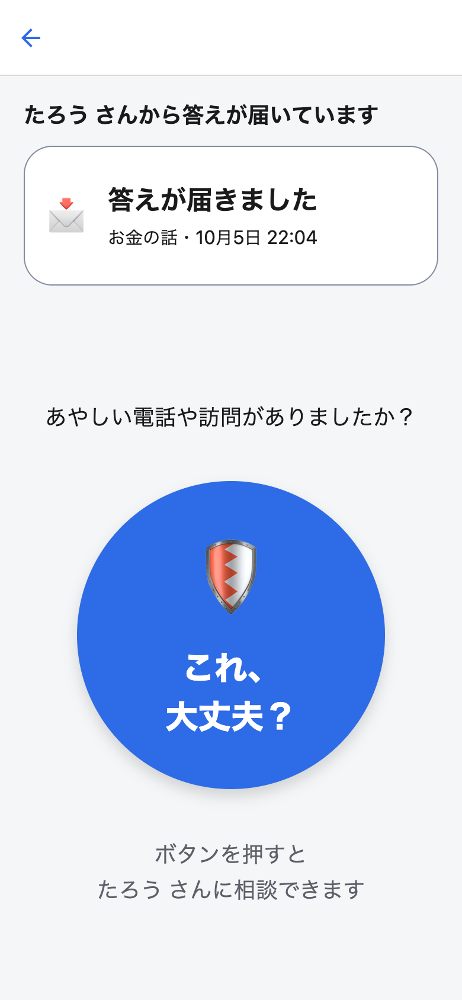
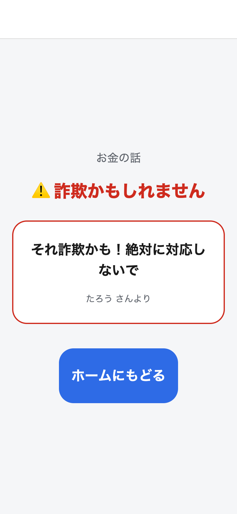

# これ、大丈夫？

高齢の親が、あやしい電話・訪問・SMS に出くわしたとき、大きなボタン1つで子にすぐ相談できる詐欺対策アプリ。




- 設計: [docs/DESIGN.md](docs/DESIGN.md)
- 技術: Expo (React Native + TypeScript) / 予定: Supabase + Expo Push

## いまの状態（MVP骨組み）

- 親フロー: ホーム →「これ、大丈夫？」→ 種類選択 → 相談中 → 答え（ホームに最近の相談の入口が最大3件。まだ開いていない答えは大ボタンより上に出る）
- 子フロー: 受信一覧 → 詳細 → 定型文、または自由入力（200字まで）＋判定（詐欺かも / 大丈夫そう / まだ分からない）で返信
- データはまだ端末内のメモリ（`src/data/store.tsx`）。次の段階で Supabase に差し替える。
- 開発用に、最初の画面で「親モード / 子モード」を切り替えられる。

## 動かし方

Node は react-native 0.86 の `engines` に合わせ、20.19.4 以上の 20 系、22.13.0 以上の 22 系、24.3.0 以上の 24 系、または 25 以上（`.nvmrc` は 20.20.0）。

```sh
nvm use            # .nvmrc の Node に切り替え（未導入なら nvm install）
npm install        # 初回のみ
npm start          # Expo 開発サーバーを起動
```

起動後、ターミナルに QR コードが出ます。

- iPhone: App Store で **Expo Go** を入れ、カメラで QR を読む
- Android: **Expo Go** を入れ、アプリ内の QR スキャンで読む

同じ Wi-Fi につないでおくこと。

### ブラウザで動かす（Web）

```sh
npm run web        # Expo 開発サーバーを起動してブラウザで開く（既定は http://localhost:8081）
```

スマホがなくても、ブラウザで一往復の流れを確かめられます。

※ 相談はメモリにだけ置いているので、Web 版ではブラウザの「戻る」や再読み込みで相談が消えます。画面の行き来はアプリ内の「戻る」や「ホームにもどる」を使ってください。

## 一往復のテスト（1台で）

1. 「親モードで開く」→「これ、大丈夫？」→ 種類を選ぶ →「〜さんに相談しています…」になる
2. 「ホームにもどる」で親のホームへ戻り、左上の戻るで最初の画面へ。「子モードで開く」
3. 届いた相談を開いて返信する（定型文をタップ、または自分の言葉を書いて判定を選び「この内容で送る」）
4. 左上の戻るで最初の画面へ戻り、「親モードで開く」→ ホームのいちばん上に出る「答えが届きました」を押すと、答えが表示される

※ 本番では2台（親・子）でリアルタイムに繋がります（Supabase 導入後）。

## この先の予定

1. Supabase 接続（メモリ → クラウド保存＆リアルタイム同期）
2. 招待コードによるペアリング（親↔子）
3. プッシュ通知（相談・返信を通知）
4. 写真添付（ハガキ/SMSを撮る）
5. 親UIの磨き込み・実地テスト